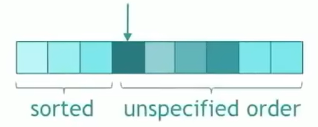
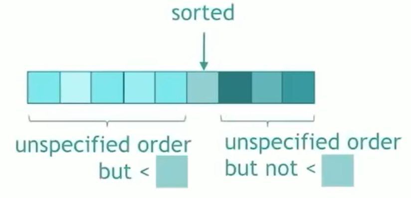

# STL
------
* HEAPS:
    > A heap is a data structure that looks like a tree. But it has a property that every node must be smaller than its children
    > A max heap which relationship between parents and children is the parents is bigger
    * std::make_heap(begin(numbers), end(numbers));
    * std::push_heap(begin(numbers), end(numbers));
        numbers.push_heap(numbers_one);
    * std::pop_heap(begin(numbers), end(numbers));
        numbers.pop_heap();
* SORT:
    * sort
    * partial_sort
        
    * nth_element
        
    * sort_heap
    * inplace_merge
* PARTIONING
    * partition


---------------
---------------

* Vector:
    * 定义:
        * vector<typename>name;
        * typename可以是任何基本数据类型, 如int, double, char, 也可以是任何自定义类型, 如结构体struct, 甚至可以是其他STL容器, 如vector本身, set, queue等.
        * 当定义typename为另一个STL容器时, 例如vector<vector<int> >, 在>>要加上空格, 避免老编译器将其误识别为移位操作符
    * 访问:
        * vector支持下标访问, 就如普通数组一样, 可以使用vectorname[index]的形式来访问或修改数组元素, 访问从0开始, 直到vectorname.size()-1
        * 也可以通过迭代器访问, 定义迭代器语法如: vector<typename>::iterator it;
            * 示例:
            ```c++
            vector<int>::iterator it = vi.begin();
            ```
            ```c++
            vector<int>::iterator it = vi.begin();
            for(int i = 0; i < vi.size(); i++){
                printf("%d ", *(it + i));//输出vi[i]
            }
            ```
    * 常用函数:
        * push_back(element): 向vector的末尾添加一个新元素
        * pop_back(): 删除vector中的最后一个元素
        * size(): 返回vector中元素个数
        * clear(): 删除vector中的所有元素, 使其变为空
        * insert(it, element): 在指定迭代器位置插入一个新元素
        * erase(it): 删除指定迭代器位置的元素
* Set:
    > set容器确保容器内部所有元素都是唯一的, 自动去除重复元素, 且该容器中的元素会按照一定的顺序排序, 默认情况下是升序
    * 定义:
        * set<typename>name;
        * 同上, 其中的typename可以是任何基本数据类型, 也可以是任何自定义类型, 也包括STL容器
    * 访问:
        * set不支持下标访问元素, 而是只能通过迭代器访问
        * 同上, 定义set<typename>:: iterator it = st,begin();
    * 常用函数:
        * insert(element): 将一个新元素插入set中
        * find(element): 在set中查找一个元素
        * erase(element): 删除set中指定的元素
        * size(): 返回set中元素的个数
        * clear(): 删除set中的所有元素
* String:
    * 常用函数:
        * length()/size(): 获取字符串长度
        * find(): 查找
        * substr(): 查子串
        * append(): 添加字符串
        * compare(): 比较字符串 s1.compare(s2)
        * tolower()/toupper(): 字符串转大小写 tolower(s1)
* 动态规划:
