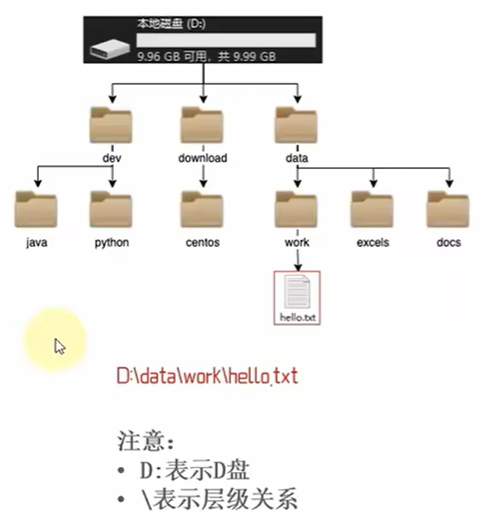
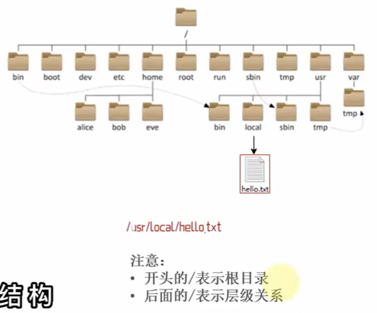
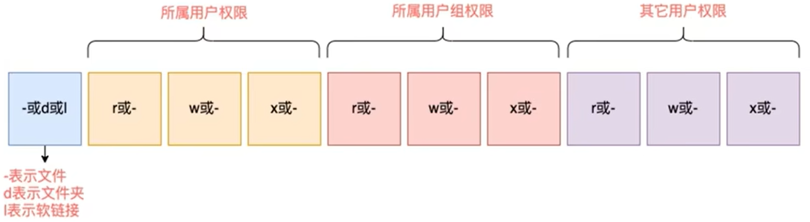

# Linux

---

1. Linux目录结构:

   * Linux的目录是一个树形结构, 相比于Windows系统可以拥有多个盘符, 如C盘, D盘. Linux系统没有盘符这个概念, 只有一个根目录/, 所有文件都在其下
   * 在Linux系统中, 路径之间的层级关系, 使用 / 来表示
   * 在Windows系统中, 系统之间的层级关系, 使用 \ 来表示
     
     
2. Linux命令基础:

   > 无论什么命令, 用于什么用途, 在Linux中, 命令有其通用的的格式:
   > command [-options] [parameter]
   >

   * command: 命令本身
   * -options: [可选, 非必填]命令的一些选项, 可以通过选项控制命令的行为细节
   * parameter: [可选, 非必填]命令的参数, 多数用于命令的指向目标等
   * 基础命令:

     * ls命令:

       > 不使用选项与参数,直接使用命令本体,将会以平铺的形式列出当前工作目录下的内容
       > ls [-a -l -h] [Linux路径]
       >

       * HOME目录: 每个Linux操作用户在Linux系统的个人账户目录, 路径在/home/用户名, 直接使用ls命令列出的工作目录就是HOME目录
       * 参数: 表示要打开的Linux路径文件夹
       * 选项:
         * -a选项: 表示all的意思,即列出全部文件(包含隐藏的文件/文件夹)
         * -l选项: 表示以列表(竖向排列)的形式展示内容, 并展示更多信息
         * -h选项: 表示以易于阅读的形式, 列出文件的大小, 如K, M, G
           * -h选项必须搭配-l一起使用
         * 命令选项可以组合使用, 比如: ls -lah 或 ls -l -a -h (顺序无关)
     * cd命令:

       > 切换工作目录, 来自英文Change Directory
       > cd [Linux路径]
       >

       * cd命令无需选项, 只有参数, 表示要切换到哪个目录下
       * cd命令直接执行, 不写参数, 表示回到用户的HOME目录
     * pwd命令:

       > 通过此命令, 可以查看当前所在的工作目录, pwd命令来自Print Work Directory
       >

       * pwd命令, 无选项, 无参数, 直接输入即可
     * 相对路径与绝对路径与特殊路径符:

       * 绝对路径: 以根目录位起点, 描述路径的一种写法, 路径描述以\开头
       * 相对路径: 以当前目录为起点, 描述路径的一种写法, 路径描述无需以\开头
       * 特殊路径符:
         * .  : 表示当前目录, 比如cd ./Desktop表示切换回当前目录下的Desktop目录内, 和cd Desktop效果一样
         * .. : 表示上一级目录, 比如cd .. 即可切换到上一级目录, cd ../..切换到上二级目录
         * ~  : 表示HOME目录, 比如cd ~即可切换到HOME目录或cd ~/Desktop, 切换到HOME内的Desktop目录
     * mkdir命令:

       > 通过mkdir命令可以创建新的目录(文件夹), 来自于英文Make Directory
       > mkdir [-p] Linux路径
       >

       * 参数必填, 表示Linux路径, 即要创建的文件夹路径, 相对路径或绝对路径均可
       * -p选项可选, 表示自动创建不存在的父目录, 适用于创建连续多层级的目录

       > 创建文件夹需要修改权限, 需要确保操作均在HOME目录内, 不要在HOME外操作, 因为会涉及到权限问题, HOME外无法成功
       >
     * touch命令:

       > 可以通过touch命令创建文件
       > touch Linux路径
       >

       * touch命令无选项, 参数必填, 表示要创建的文件路径, 相对, 绝对路径, 特殊路径符均可以使用
     * cat命令:

       > 准备好文件内容后, 可以通过cat查看内容
       > cat 表示Linux路径
       >

       * cat同样没有选项, 只有必填参数, 参数表示: 被查看的文件路径, 相对, 绝对路径, 特殊路径符均可以使用
     * more命令:

       > more命令同样可以查看文件内容, 但cat是直接将内容全部显示出来, more支持翻页, 如果文件内容过多, 可以一页页的显示
       > more Linux路径
       >

       * 同样没有选项, 只有必填参数, 参数表示: 被查看的文件路径, 相对, 绝对路径, 特殊路径符均可以使用
     * cp命令:

       > cp命名可以用于复制文件\文件夹, cp命令来自英语单词copy
       > cp [-r] 参数1 参数2
       >

       * -r选项, 可选, 用于复制文件夹使用, 表示递归
       * 参数1, Linux路径, 表示被复制的文件或文件夹
       * 参数2, Linux路径, 表示要复制去的地方
     * mv命令:

       > mv命令可以用于移动文件\文件夹, mv命令来源于英语单词move
       > mv 参数1 参数2
       >

       * 参数1, Linux路径, 表示被移动的文件或者文件夹
       * 参数2, Linux路径, 表示要移动去的地方, 如果目标不存在, 则进行改名, 确保目标存在

       > 故mv命令可以用于移动文件或者改名操作
       >
     * rm命令:

       > rm命令可以用于删除文件\文件夹, 来源于英语单词remove
       > rm [-r -f] 参数1 参数2 …… 参数n
       >

       * 同cp命令一样, -r选项用于删除文件夹
       * -f表示force, 强制删除(不会弹出确认提示信息)

         * 普通用户删除不会弹出提示, 只有root管理员用户删除内容会有提示
         * 所以一般普通用户用不到-f选项
       * 参数1, 参数2, ……, 参数n表示要删除的文件或文件夹路径, 按照空格隔开
       * 通配符:

         > 符号* 表示通配符, 即匹配任意内容(包含空), 实例:
         >

         * test*, 表示任何以test开头的内容
         * *test, 表示匹配任何以test结尾的内容
         * \*test\*, 表示匹配任何包含test的内容
     * which命令:

       > Linux命令本质上就是一个个二进制可执行程序, 与Windows下的.exe文件是一个意思, 可以通过which命令, 查看所使用的一系列命令的程序文件存放在哪里
       > which 要查找的命令
       >
     * find命令:

       > 在Linux系统中, 我们可以通过find命令去搜索指定的文件
       >

       1. 按文件名进行搜索

          > find 起始路径 -name "被查找文件名"
          >

          * 可以使用通配符结合find命令做文件的模糊查找
       2. 按文件大小进行搜索

          > find 起始路径 -size +|-n[kMG]
          >

          * +, -表示和小于
          * kMG表示大小单位, k(小写字母)表示kb, M表示MB, G表示GB
     * grep命令:

       > 可以通过grep命令, 从文件中通过关键字过滤文件行
       > grep [-n] 关键字 文件路径
       >

       * 选项-n, 可选, 表示在结果中显示匹配的行的行号
       * 参数, 关键字, 必填, 表示过滤的关键字, 带有空格或其他特殊符号, 建议使用""将关键字包围起来
       * 参数, 文件路径, 必填, 表示要过滤内容的文件路径, 可以作为内容输入端口
     * wc命令:

       > 可以通过wc命令统计文件的行数, 单词数量等
       > wc [-c -m -l -w] 文件路径
       >

       * 选项, -c, 统计bytes数量
       * 选项, -m, 统计字符数量
       * 选项, -l, 统计行数
       * 选项, -w, 统计单词数量
       * 参数, 文件路径, 被统计的文件, 可作为内容的输入端口
     * 管道符:

       > 可以通过|, 将左边命令的结果, 作为右边命令的输入
       >

       * 例如:

         * cat test.txt | grep hello | wc -l

         > 打开test.txt文件, 查询带hello关键字的文件, 统计有几行
         >
     * echo命令:

       > 可以通过echo命令在命令行内输出指定内容
       > echo 输出内容
       >

       * 无需选项, 只有一个参数, 表示要输出的内容, 复杂内容可以用""包围
       * 带有空格或\等特殊符号, 建议使用双引号包围, 因为不包围的话, 空格后面很容易被识别为参数2
     * 反引号:

       > 可以通过`, 使被其包围的字符作为命令执行, 而非普通字符
       >

       * 例如:

         * echo \`pwd\`

         > 将会执行pwd命令, 之后echo会将其打印
         >
     * 重定向符:

       * > , 将左侧命令的结果, 覆盖写入到符号右侧指定的文件中
         >
       * >> , 将左侧命令的结果, 追加写入到符号右侧指定的文件中
         >>
         >
     * tail命令:

       > 使用tail命令, 可以查看文件尾部内容, 跟踪文件的最新更改, 语法如下:
       > tail [-f -num] Linux路径
       >

       * 参数, Linux路径, 表示被跟踪的文件路径
       * 选项, -f, 表示持续跟踪
       * 选项, -num, 此处填写数字, 表示查看尾部多少行, 不填默认10行
   * root用户:

     * 切换root用户:

       > root用户拥有最大的系统操作权限, 而普通用户在许多地方的权限是受限的
       >

       * 普通用户的权限, 一般在HOME目录内是不受限的
       * 一旦出了HOME目录, 大多数地方, 普通用户仅有只读和执行权限, 无修改权限

       > 可以通过su命令来用于用户切换, 来源于Switch User
       > su [-] [用户名]
       >

       * -, 符号可选, 表示是否在切换用户后加载环境变量, 一般建议带上
       * 参数: 用户名, 表示要切换的用户, 用户名也可以省略, 省略表示切换到root
       * 切换用户后, 可以通过exit命令退回到上一个用户, 也可以使用快捷键Ctrl+d
     * sudo命令:

       > 可以通过su命令切换到root获得最大权限, 但是不建议长期使用root用户, 避免带来系统损坏
       > 可以使用sudo命令, 为普通命令授权, 临时以root身份执行
       > sudo 其他命令
       >

       * 在其他命令之前带上sudo, 可以为这一条命令赋予root授权
       * 但并不能让所有用户都有权力使用sudo, 我们要为普通用户配置sudo认证
    * 用户与用户组:
       > Linux系统中可以配置多个用户, 可以配置多个用户组, 用户可以加入多个用户组, 这是因为Linux中关于权限管控有2个等级, 分别为针对用户的权限控制和针对用户组的权限控制
        * 用户组管理
            * 创建用户组:
                > groupadd 用户组名
            * 删除用户组:
                > groupdel 用户组名
            * 查看系统全部组信息:
                > getent group
        * 用户管理:
            * 创建用户:
                > useradd [-g -d] 用户名
                * 选项: -g指定用户的组, 不指定-g, 会创建同名组并自动加入, 指定-g需要组已经存在, 如已存在同名组, 必需使用-g
                * 选项: -d指定用户HOME路径, 不指定-d, HOME目录默认在: /home/用户名
            * 删除用户:
                > userdel [-r] 用户名
                * 选项: -r, 删除用户的HOME目录, 不使用-r, 删除用户时, HOME目录保留
            * 查看用户所属组
                > id [用户名]
                * 参数: 用户名, 被查看的用户, 如果不提供则查看自身
            * 修改用户所属组
                > 将指定用户加入到指定用户组
                > usermod -aG 用户组 用户名
            * 查看当前系统中有哪些用户
                > getent passwd
                * 显示时一行会有七份信息:
                    > 用户名:密码(x):用户ID:组ID:描述信息(无用):HOME目录:执行终端(默认bash)
        * 权限信息:
            *  权限信息解析:
            
            * r, read 读
                * 针对文件, 可以查看文件内容
                * 针对文件夹, 可以查看文件夹内容, 如ls命令
            * w, write 写
                * 针对文件表示可以修改此文件
                * 针对文件夹, 可以在文件夹内: 创建, 删除, 改名等操作
            * x, excecute 执行
                * 针对文件表示可以将文件作为程序执行
                * 针对文件夹, 表示可以更改工作目录到此文件夹, 即cd进入
            * -, 没有权限
        * chmod命令:
            > 可以通过chmod命令, 修改文件, 文件夹的权限信息, 来自英文change mode
            > 注意, 只有文件, 文件夹的所属用户或root用户可以修改
            > chmod [-R] 权限 文件或文件夹
            * -R, 对文件夹内的全部内容应用同样的操作, 若未使用-R则仅应用于文件夹本身
            * 示例:
                > chmod u=rwx,g=rx,o=x hello.txt
                * u, 表示user所属用户的权限
                * g, 表示group组权限
                * o, 表示other其他用户权限
            * 权限的数字表示:
                > 权限可以用3位数字来代表, 第一位数字表示用户权限, 第二位表示用户组权限, 第三位表示其他用户权限
                * 0: 无任何权限, 即---
                * 1: 仅有x权限, 即--x
                * 2: 仅有w权限, 即-w-
                * 3: 有w和x权限, 即-wx
                * 4: 仅有r权限, 即r--
                * 5: 有r和x权限, 即r-x
                * 6: 有r和w权限, 即rw-
                * 7: 有全部权限, 即rwx
                > 故以上指令也可表示为 chmod 751 hello.txt
        * chown命令:
            > 使用chown命令, 可以修改文件, 文件夹的所所属用户和用户组
            > 普通用户无法修改所属为其他用户或组, 所以此命令只适用于root用户执行
            > chown [-R] [用户] [:] [用户组] 文件或文件夹
            * 选项, -R, 同chmod, 对文件夹内全部内容应用相同规则
            * 选项, 用户, 修改所属用户
            * 选项, 用户组, 修改所属用户组
            * : ,  用于分隔用户与用户组
