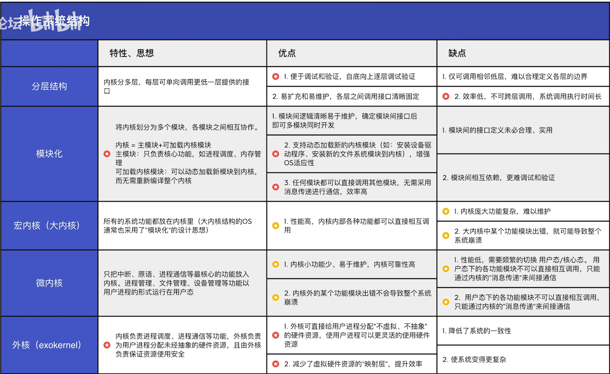
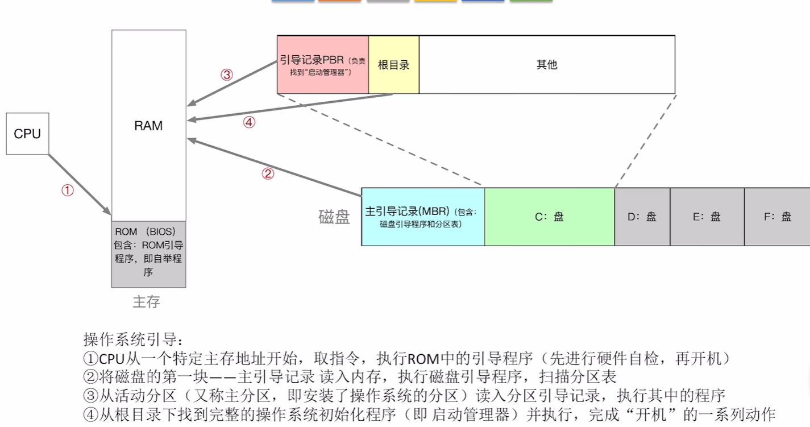
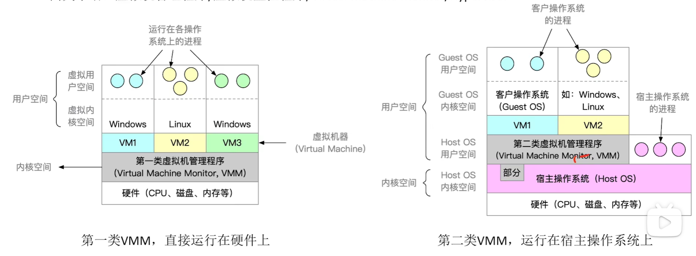
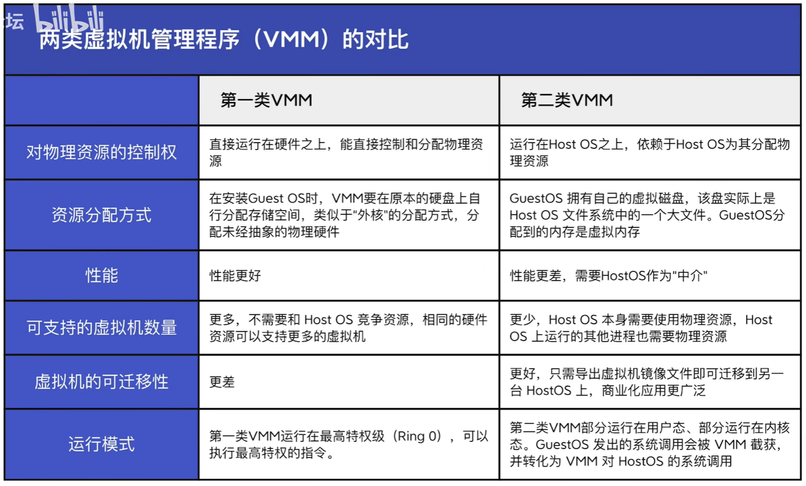
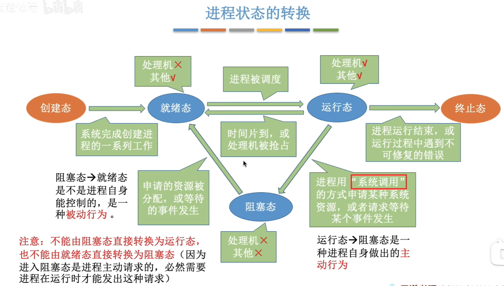

# 操作系统
------
* 操作系统引论:
    1. 概念: 
        * **操作系统(Operating System, OS)是指控制和管理整个计算机系统的硬件和软件资源, 并合理地组织调度计算机的工作和资源的分配; 以提供给用户和其他软件方便的接口和环境; 它是计算机系统中最基本的系统软件.**
            1. 操作系统是系统资源的管理者
                1. 提供功能:
                    1. 处理机管理
                    2. 存储器管理
                    3. 文件管理
                    4. 设备管理
            2. 操作系统向上层提供方便易用的服务
                1. 直接给用户使用的
                    * GUI(Graphical User Interface, 图形用户界面):用户可以使用形象的图形界面进行操作, 无需记忆复杂的命令与参数
                    * 命令接口
                        * 联机命令接口: 联机命令接口=交互式命令接口(用户说一句, 系统做一句, 例如cmd)
                        * 脱机命令接口: 脱机命令接口=批处理命令接口(用户说一堆, 系统做一堆, 例如.bat文件)
                2. 给软件/程序员使用的
                    * 程序接口(系统调用):在程序中进行系统调用来使用程序接口, 普通用户不能直接使用程序接口, 只能通过程序代码间接调用
            3. 操作系统是最接近硬件的一层软件
                * 没有任何软件支持的计算机称为裸机
                * 通常把覆盖了软件的机器称为扩充机器, 又称之为虚拟机
        > 注: 
        >     一个程序需要放入内存并给它分配CPU才能执行
    2. 操作系统的特征:
        1. 并发: 指多个事件在**同一时间间隔**内发生, 这些事件在宏观上是同时发生的, 微观上是交替发生的.
            * 并行: 指多个事件在**同一时刻**同时发生.
            * 操作系统的并发性是指计算机系统中"同时"运行着多个程序, 这些程序从宏观上看是同时运行着的, 微观上看是交替运行的.
            * 单核CPU同一时刻只能执行一个程序, 各个程序只能并发地执行
            * 多核CPU同一时刻可以同时执行多个程序, 多个程序可以并行地执行
        2. 共享: 即资源共享, 是指系统中的资源可供内存中的多个并发执行的进程共同使用.
            * 互斥共享方式: 计算机中的某些资源, 虽然可以供给多个进程使用, 但一个时间段内只允许一个进程访问该资源.
            * 同时共享方式: 系统中的某些资源, 允许一个时间段内由多个进程"同时"对它们进行访问.("同时"往往是宏观上的, 而在微观上, 这些进程可能是交替地对该资源进行访问的(即分时访问))
        > 注: 
        >    并发性指计算机系统中同时存在着多个运行着的程序
        >    共享性是指系统中的资源可以供内存中多个并发执行的进程共同使用
        3. 虚拟: 是指把物理上的实体变为若干个逻辑上的对应物, 物理实体是实际存在的, 而逻辑上的对应物是用户感受到的.
            * 空分复用技术: 如虚拟存储技术.
            * 时分复用技术: 微观上处理机在各个微小的时间段内交替为各个进程服务, 如虚拟存储器.
        4. 异步: 在多道程序环境下, 允许多个程序并发执行, 但由于资源有限, 进程的执行不是一贯到底的, 而是走走停停, 以不可预知的速度向前推进, 这就是进程的异步性.
    3. 发展与分类:
        1. 手工操作阶段: 操作系统还未诞生
            * 主要缺点: 用户独占全机, 人机速度矛盾导致资源利用率极低.
        2. 批处理阶段(单道批处理系统)
            * 引入脱机输入/输出技术(用外围机+磁带(处理速度远快于纸带机)完成), 并由监督程序(操作系统的雏形)负责作业的输入与输出
            * 主要缺点: 内存中仅能有一道程序运行, 只有该程序结束后才能调入下一道程序, 资源利用率仍然很低.
        3. 批处理阶段(多道程序并发运行): 操作系统正式诞生, 用于支持多道程序并发运行
            * 优点: 多道程序并发执行, 共享计算机资源, 资源利用率大幅提升, CPU和其他资源更能保持"忙碌"状态, 系统吞吐量增大.
            * 缺点: 用户响应时间长, 没有人机交互功能
        4. 分时操作系统
            * 计算机以时间片为单位轮流为各给用户/作业服务, 各个用户可以通过终端与计算机进行交互.
            * 优点: 用户的请求可以被即使响应, 解决了人机交互问题. 允许多个用户同时使用一台计算机, 并且用户对计算机的操作相互独立, 感受不到被人的存在.
            * 缺点: 不能有限处理一些紧急任务, 操作系统对各个用户/作业完全是公平的, 循环的为每一个用户/作业服务一个时间片, 不区分任务的紧急性.
        5. 实时操作系统:
            * 优点: 能够优先响应一些紧急任务, 某些紧急任务不需要时间片排队
            * 在实时操作系统的控制下, 计算机系统接收到外部信号后及时进行处理, 并且要求在严格的时限内处理完事件, 实时操作系统的主要特点是及时性和可靠性.
            * 硬实时系统: 必须在绝对严格的规定时间内完成处理
            * 软实时系统: 能接受偶尔违反时间规定
        * 其他操作系统: 略
    4. 操作系统运行机制:
        * "内核(Kernel)"是操作系统最核心的部分, 也是最接近硬件的的部分.(甚至可以说一个操作系统只要有内核就够了, 例如在Docker中仅需Linux内核就可以实现Lunix全部功能)
            * 内核态: CPU两种状态之一, 说明此时运行的是内核程序, 此时可以执行特权指令.
            * 用户态: CPU两种状态之一, 说明此时运行的是应用程序, 此时只能执行非特权指令.
            * CPU中有一个寄存器位PSW(程序状态字), 其中有个二进制位, 1表示"内核态", 0表示"用户态".
            * 内核态=核心态=管态; 用户态=目态
            * 内核态 -> 用户态: 执行一条特权指令--修改PSW的标志位"用户态", 这个动作意味着操作系统主动让出CPU使用权.
            * 用户态 -> 核心态: 由"中断"引发, 硬件自动完成变态过程, 触发中断信号意味着操作系统强行夺回CPU的使用权力.
        * "指令"就是处理器(CPU)能识别, 执行的最基本命令.
            * 特权指令: 只允许操作系统内核来使用, 如内存清零指令
            * 非特权指令: 例如应用程序只能使用"非特权指令", 如加法指令, 减法指令等
    5. 中断与异常:
        * 中断的作用: 中断会使CPU由用户态变成内核态, 使操作系统重新夺回对CPU的控制权."中断"是让操作系统内核夺回CPU使用权的唯一途径.
        * 中断的分类(广义的中断):
            * 内中断(异常):与当前执行的指令有关, 中断信号来源于CPU内部
                * 陷阱, 陷入(trap): 由陷入指令引发, 是系统程序故意引发的
                * 故障(fault): 由错误条件引起, 可能被内核程序修复, 内核程序修复故障后会把CPU的使用权还给应用程序, 让他继续执行下去, 例如缺页故障
                * 终止(abort): 由致命错误引起, 内核程序无法修复该错误, 因此一般不再将CPU使用权还给引发终止的应用程序, 而是直接终止该应用程序, 如: 整数除0, 非法使用特权指令.
            * 外中断(也称"中断", 是狭义的中断):与当前执行的指令无关, 中断信号来源于CPU外部
                * 时钟中断
                * I/O中断
        * 中断机制的基本原理: 
            * 检查中断信号,判断内外中断.
            * 找到相应的中断处理程序: 不同的中断信号, 需要不同的中断处理程序来处理. 当CPU检测到中断信号后, 会根据中断信号的类型去查询中断向量表, 以此来找到相应的中断处理程序在内存中的存放位置
            * 显然中断处理程序一定是内核程序, 需要运行在"内核态"
    6. 系统调用:
        > "系统调用"是操作系统提供给应用程序(程序员/编程人员)使用的接口, 可以理解为一种可供应用程序调用的特殊函数, 应用程序可以通过系统调用来请求获得操作系统内核的服务
        * 应用程序通过系统调用请求操作系统服务, 而系统中的各种共享资源都由操作系统内核统一掌管, 因此凡是与共享资源有关的操作(如存储分配, I/O操作, 文件管理等), 都必须通过系统调用的方式向操作系统内核提交出服务请求, 由操作系统内核代为完成, 这样可以保证系统的稳定性和安全性, 防止用户进行非法操作
        * 系统调用:
            * 设备管理: 完成设备的请求/释放/启动等功能
            * 文件管理: 完成文件的读/写/创建/删除等功能
            * 进程控制: 完成进程的创建/撤销/阻塞/唤醒等功能
            * 进程通信: 完成进程之间的消息传递/信号传递等功能
            * 内存管理: 完成内存的分配/回收等功能 
        * 系统调用的过程:
            1. 传递系统调用参数
            2. 执行陷入指令(用户态)
            3. 执行对应的请求内核程序处理系统调用(核心态)
            4. 返回应用程序
            * 注意:
                1. 陷入指令是在用户态执行的, 执行陷入指令后立即引发一个内中断, 使CPU进入核心态
                2. 发出系统调用请求是在用户态, 而对系统调用的相应处理在核心态下进行.
    7. 操作系统内核:
        > 内核是操作系统最基本, 最核心的部分
        * 操作系统内核
            * 时钟管理: 实现计时功能
            * 中断处理: 负责实现中断机制
            * 原语:
                * 是一种特殊的程序
                * 处于操作系统最底层, 是最接近硬件的部分
                * 这种程序的运行有原子性--其运行只能一气呵成, 不可中断
                * 运行时间短, 调用频繁
            > 以上是与硬件关联较紧密的模块, 仅包含以上为微内核
            * 对系统资源进行管理的功能:
                * 进程管理
                * 存储器管理
                * 设备管理
            > 除去时钟管理, 中断处理, 原语等这些管理工作更多是对数据结构的操作, 不会直接涉及硬件.
            > 包含时钟管理, 中断处理, 原语及对系统资源进行管理的功能为大内核
        * 操作系统体系结构: 
            * 大内核(宏内核):
                * 将操作系统的主要功能模块都作为系统内核, 运行在核心态
                * 优点: 高性能
                * 缺点: 内核代码庞大, 结构混乱, 难以维护
            * 微内核:
                * 只把最基本的功能保留在内核
                * 优点: 内核功能少, 结构清晰, 方便维护
                * 缺点: 需要频繁地在核心态与用户态之间切换, 性能低.
            * 分层结构:
                * 内核分多层, 每层可单向调用更低一层提供的接口.
                * 优点:
                    * 便于调试与验证, 自顶
                    * 易于调用扩充与维护, 各层之间调用接口清晰固定
                * 缺点:
                    * 仅可调用邻层, 难以定义各层边界
                    * 效率低, 不可跨层调用, 系统调用执行时间长
            * 模块化:
                > 内核=主模块+可加载内核模块
                > 主模块: 只负责核心功能, 如进程调度, 内存管理
                > 可加载内核模块: 可以动态加载新模块到内核, 而无需重新编译整个模块
                * 优点:
                    * 模块逻辑清晰易于维护, 确定模块接口后可多模块同时开发
                    * 支持动态加载新的内核模块, 增强OS适应性
                    * 任何模块都可以直接调用其他模块, 无需采用消息传递进行通信, 效率高
                * 缺点:
                    * 模块间的接口定义未必合理实用
                    * 模块相互依赖, 难以调试与验证
            * 总览表:
            
    8. 操作系统引导(root):
        
    9. 虚拟机:
        > 虚拟机: 使用虚拟化技术, 将一台物理机器虚拟化为多台虚拟机器(Virtual Machine, VM), 每个虚拟机器都可以独立运行一个操作系统
        > 同义术语: 虚拟机管理程序/虚拟机监控程序/Virtual Machine Monitor/Hypervisor
        
        
* 进程:
    1. 进程基本概念:
        * 进程(Process): 是动态的, 是程序的一次执行过程(同一个程序多次执行会对应多个进程)
        * 程序: 是静态的, 就是存放在磁盘里的可执行文件, 就是一系列指令集合
    2. 进程(进程实体(进程映像), 进程是动态的, 而进程实体(进程映像)是静态的)的组成:
        * **由PCB(给操作系统用的), 程序段, 数据段组成(给进程自己用的)**
        > 当进程被创建时, 操作系统会为该进程分配一个唯一的, 不重复的"身份证号"--PID(Process ID, 进程ID)
        * 操作系统要记录PID, 进程用户所属ID
        * 记录给进程分配了多少内存, 正在使用的IO设备, 正在使用的文件等资源
        * 记录进程CPU使用时间, 磁盘使用情况, 网络流量使用情况等运行情况
        * **以上这些信息都被保存在一个数据结构PCB(Process Control Block), 即进程控制块**
        * PCB组成:
            * 进程描述信息:
                * 进程标识符PID
                * 用户标识符UID
            * 进程控制和管理信息:
                * CPU, 磁盘, 网络流量使用情况
                * 进程当前状态: 就绪态/阻塞态/运行态...
            * 资源分配清单:
                * 正在使用哪些文件
                * 正在使用哪些内存区域
                * 正在使用哪些I/O设备
            * 处理及相关信息:
                * 如PSW, PC等各种寄存器的值
        * 程序段:
            > 程序的代码(指令序列)
        * 数据段:
            > 运行过程中产生的各种数据
        * 进程是进程实体的运行过程, 是系统进行资源分配与调度的一个独立单位
        * 进程的特性:
            * 动态性
            * 并发性
            * 独立性
            * 异步性
            * 结构性
    3. 进程的状态与转换:
        * 三种基本状态:
            * 运行态(Running): 占有CPU, 并在CPU上运行
            * 就绪态(Ready): 已经具备运行条件, 但是由于没有空闲CPU, 而暂时不能运行
            * 阻塞态(Waiting/Blocked): 因等待某一事件而暂时不能运行
        * 另外两种状态:
            * 创建态(New, 又称: 新建态): 进程正在被创建, 操作系统为进程分配资源, 初始化PCB
            * 终止态(Terminated, 又称: 结束态): 进程正在从系统中撤销, 操作系统会回收进程所拥有的资源, 销毁PCB
        > 进程PCB中, 会有一个变量state来表示进程的当前状态
        * 状态间转换:
            * 就绪态 -> 运行态: 进程被调度
            * 运行态 -> 就绪态: 时间片到, 或CPU被其他高优先级的进程抢占
            * 运行态 -> 阻塞态: 等待系统资源分配, 或等待某件事发生(主动行为)
            * 阻塞态 -> 就绪态: 资源分配到位, 等待的事情发生(被动行为)
            * 创建态 -> 就绪态: 系统完成创建进程相关的工作
            * 运行态 -> 终止态: 进程运行结束, 或运行过程中遇到不可修复的错误    
        