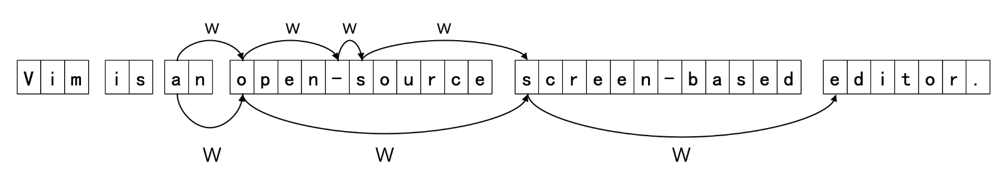
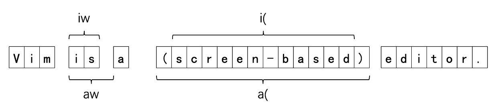

# vim
------
# 模式
1. Normal:
2. Insert:
3. Command
4. Visual 

------
#### 基本使用
* Normal:
    1. 基本移动命令:
        * hjkl:左下上右
        * gg:跳到第一行
        * G: 跳到最后一行
        * <Ctrl-u>/<Ctrl-b>:往上翻半页/一页
        * <Ctrl-d>/<Ctrl-f>:往下翻半页/一页
        * {lineno}gg: 跳到第lineno行
        * zz/zb/zt:光标行设置为 屏幕居中/屏幕第一行/屏幕最后一行
    2. 进入Insert模式:
        * i:代表"Insert", 当前光标之前开始输入
        * a:代表"append", 当前光标之后开始输入
        * o:下方插入新的一行, 然后开始输入
        * s:删除当前光标的字符, 然后开始输入
        * I:在本行的开头开始输入
        * A:在本行的末尾开始输入
        * O:上方插入新的一行, 然后开始输入
        * S:删除当前行, 然后开始输入
        * <Esc> -回到Normal模式
    3. 进入Command模式:
        >Normal 模式下输入:进入(shift + :/;)
        * :w  -保存当前文件
        * :q  -退出
        * :q! -放弃当前更改, 然后退出
        * :wq -保存当前更改, 然后退出
        * :h{command}  -显示关于命令的帮助
        * <Esc> -回到Normal模式        
    4. 进入Visual模式:
        >Normal 模式下按v进入Visual(可视)模式
        * 进入Visual模式后可以用Normal模式下的移动命令选择文本
        * Visual模式下x/y:剪切/复制; 回到Normal模式下p: 粘贴
        * Normal模式下按V进入行可视模式, 一次选中一整行, 在需要选中很多行时很方便
        *  <Esc> -回到Normal模式 
------
#### 高效的移动
* Normal
    1. 移动
        * w: 代表'word', 跳转到下一处单词的开头
        * b: 代表'back', 跳转到上一处单词的开头
        * e: 代表'end', 跳转到下一处单词的结尾
        * ge: e的反向版本, 跳转到上一处单词的结尾
   
        >将wbe大写则其对应的单词是连续的非空字符

    

    2. 基于搜索的移动: 
        * f{char}/t{char}  : 跳转到本行下一个char字符出现处/出现前
        * ; / ,  : 快速向后/向前重复 f/t 查找
        * F{char}/T{char}  : 往前搜索而非往后
    3. 文件中搜索: 
        * /{pattern}  : 跳转到本文件中下一个pattern出现的地方
        * ?{pattern}  : 跳转到本文件中上一个pattern出现的地方
        * pattern  : 可以是正则表达式
        * \*  : 等价于/{pattern}, pattern是当前光标下的单词
        * nN  : 快速重复/查找
    4. 基于标记的移动:
        * m{mark}  : 把当前位置标记为mark
        * `{mark}  : 跳转到名为mark的标记位置
        > mark为a-z的字符
        >一般多用作需要临时离开当前光标处, 做一些事情后再迅速回来
        >一般可以简单打为mm
        * 内置标志:
            * ``  : 上次跳转前的位置
            * `.  : 上次修改的位置
            * `^  : 上次插入的位置
    5. 其他实用的跳转:
        * ^/$  : 跳转到本行的开始/结尾
        * %    : 跳转到匹配的配对符(括号等)处
------
#### 高效的编辑
* Normal
    >{operator}(montion)  : 一次编辑动作
    > operator  : 操作
    > montion   : 动作
    1. 常见操作符: 
        * c  : 代表"change", 修改, 删除内容, 并进入插入模式
        * d  : 代表"delete:, 删除
        * y  : 代表"yank", 复制
        * v  : 代表"visual", 选中文本, 进入可视模式
        >大部分操作符连续操作两次(cc/dd/yy)  : 将其作用在这一行上
        >例如 dd  : 删除这一行
        
        * 例子：
            * dgg  : 删除到第一行
            * ye   : 复制到单词结尾
            * d$   : 删除到行尾
            * dt   : 删除直到分号为止的内容
    2. 重复操作: 
        * .  : 重复上一次操作
        * u  : 撤销上一次修改
        * <Ctrl-r>  : 重做上一次修改
    3. 批量操作: 
        > {count}{action}: 重复count次action动作
        > 动作可以是移动或者编辑动作
        * 4j  : 向下移动4行
        * 3dw : 删除3个单词
        * 2yy : 复制2行
        * 4p  : 黏贴4次
        > .命令可以直观地看到每一次的变化, 在适合的时候停止
        > 数字+动作则需要预先知道动作的次数
        * 技巧: 
            > 当涉及行操作时, 使用相对行号能更直观的确定范围
            * :set relativenumber  : 开启    
            * :set norelativenumber  : 关闭 

------
#### 文本对象操作
* Normal:
    > textobjects  : 语义化文本片段
    > 格式: i/a + 对象
    * 常见的对象:
        * w/W, s, p: 单词, 句子, 段落
        * (/), [\/], {/}, </>, '/"  : 匹配符定义的对象
        >i代表"inner", 内部; a代表"a", 额外包括周围的空格或匹配符
        
        * 例子:
            > 文本对象提供了为文本赋予结构化的含义, 允许我们以一个语义对象为操作单元
            >[\count]{operator}{textobjects}
            * diw  : 删除一个单词
            * ci(  : 修改小括号内部
            * yi(  : 复制大括号内部
            >通过组合operator与textobjects, 可以对不同的语义对象实施不同的操作, 不仅十分灵活, 而且语义明确, 容易记忆
            >配合.命令或者[\count] 
    * textobject VS motion
        > {operator}{motion} 与 {operator}{textobject}    
        解耦了操作与操作对象, 大大提升了操作效率
        * motion 是能够移动光标的命令, 可以独立使用(如web)
        * 文本对象只能跟在operator后面, 不能独立使用(如iw)
        * motion通过光标的移动确定operator的作用范围, 范围更加灵活但不够明确
        * textobject则是显式地指定操作对象, 范围明确
    * 操作符与命令补充:
        * gu/gU/g~  : 操作符, 转小写/转大写/翻转大小写
        * J         : jion, 连接两行
        * <Ctrl-a>/<Ctrl-x>  : 增加数字/减少数字
        * g<Ctrl-A>  : 创建递增序列
        * <  : 左缩进
        * \>  : 右缩进
------
#### 寄存器与宏
* Normal
    * 寄存器
    > Vim提供了许多寄存器用于存放内容, 可以理解为剪切板
    > 一个字符对应一个寄存器(如a-z, 0-9)
    * 特别的寄存器:
        * "  : 默认寄存器
        * %  : 当前文件名
        * .  : 上一次插入的内容
        * :  : 上一次执行的命令
        * :reg{register}  : 查看对应寄存器中的内容
    * 指定寄存器: 
        > 在复制/删除/粘贴等操作前加上"{register}就可以指定本次操作所用的寄存器
        > 只要涉及寄存器的操作都可以这样指定
        * 